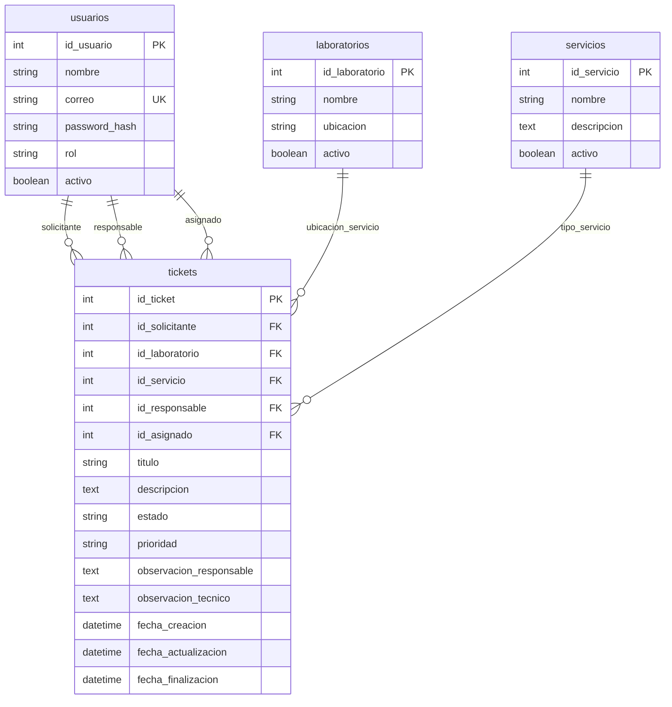

# Actividad 2 — Comprensión del problema y modelo de datos

Documento de referencia alineado con la guía del taller y con la fuente canónica en código: [`app/domain/actividad2.py`](../app/domain/actividad2.py), [`app/models.py`](../app/models.py) y [`app/domain/ticket_rules.py`](../app/domain/ticket_rules.py).

## A. Planteamiento del problema

La universidad necesita una API para gestionar solicitudes de servicio en laboratorios: un usuario crea un ticket eligiendo laboratorio y tipo de servicio; el responsable técnico recibe la solicitud, la asigna a auxiliar o técnico especializado, revisa el avance y cierra el ticket cuando el servicio queda atendido.

El acceso se controla con **JWT** y **scopes**: cada rol solo ejecuta las acciones permitidas (implementación en actividades 4 y 5).

## B. Roles del sistema

| Rol | Descripción |
|-----|-------------|
| `solicitante` | Crea tickets y consulta sus propias solicitudes. |
| `responsable_tecnico` | Recibe, asigna y finaliza tickets. |
| `auxiliar` | Atiende tickets asignados a él; actualiza estado según el flujo. |
| `tecnico_especializado` | Igual que auxiliar; tickets de mayor complejidad. |
| `admin` | Acceso total: ver y gestionar cualquier recurso. |

## C. Scopes y roles que los poseen

Los scopes van en el payload del token JWT (`ROLE_SCOPES` en código).

| Scope | Descripción | Roles |
|-------|-------------|--------|
| `tickets:crear` | Crear nuevos tickets | solicitante, admin |
| `tickets:ver_propios` | Ver tickets donde participa (solicitante, responsable o asignado) | solicitante, auxiliar, tecnico_especializado, responsable_tecnico, admin |
| `tickets:recibir` | solicitado → recibido | responsable_tecnico, admin |
| `tickets:asignar` | recibido → asignado | responsable_tecnico, admin |
| `tickets:atender` | asignado → en_proceso; en_proceso → en_revision | auxiliar, tecnico_especializado, admin |
| `tickets:finalizar` | en_revision → terminado | responsable_tecnico, admin |
| `tickets:ver_todos` | Listar/ámbito global de tickets | admin |
| `usuarios:gestionar` | Crear, listar y consultar usuarios | admin |

## D. Flujo de estados del ticket

Solo están permitidas estas transiciones; cualquier otro par debe rechazarse (validación en API).

| Estado actual | Estado siguiente | Quién puede (rol) | Scope requerido |
|---------------|------------------|-------------------|-----------------|
| solicitado | recibido | responsable_tecnico, admin | `tickets:recibir` |
| recibido | asignado | responsable_tecnico, admin | `tickets:asignar` |
| asignado | en_proceso | auxiliar o tecnico_especializado **asignado**, admin | `tickets:atender` |
| en_proceso | en_revision | auxiliar o tecnico_especializado **asignado**, admin | `tickets:atender` |
| en_revision | terminado | responsable técnico **del ticket**, admin | `tickets:finalizar` |

Reglas adicionales en runtime: al pasar a **recibido** se registra el responsable; de **recibido** a **asignado** se exige `id_asignado` con rol auxiliar o técnico especializado.

## E. Modelo de datos (tablas principales)

### usuarios

| Campo | Tipo | Descripción |
|-------|------|-------------|
| id_usuario | Integer PK | Identificador único |
| nombre | String | Nombre completo |
| correo | String unique | Correo (login) |
| password_hash | String | Hash bcrypt |
| rol | String | Rol del sistema |
| activo | Boolean | Puede iniciar sesión |

### laboratorios

| Campo | Tipo | Descripción |
|-------|------|-------------|
| id_laboratorio | Integer PK | Identificador único |
| nombre | String | Nombre del laboratorio |
| ubicacion | String | Ubicación física |
| activo | Boolean | Operativo |

### servicios

| Campo | Tipo | Descripción |
|-------|------|-------------|
| id_servicio | Integer PK | Identificador único |
| nombre | String | Nombre del servicio |
| descripcion | String/Text | Descripción del soporte |
| activo | Boolean | Disponible |

### tickets

| Campo | Tipo | Descripción |
|-------|------|-------------|
| id_ticket | Integer PK | Identificador único |
| id_solicitante | FK → usuarios | Quien crea el ticket |
| id_laboratorio | FK → laboratorios | Laboratorio |
| id_servicio | FK → servicios | Tipo de servicio |
| id_responsable | FK → usuarios, nullable | Responsable técnico |
| id_asignado | FK → usuarios, nullable | Auxiliar o técnico asignado |
| titulo | String | Título breve |
| descripcion | String/Text | Detalle del problema |
| estado | String | Estado del flujo |
| prioridad | String | baja / media / alta |
| observacion_responsable | Text, nullable | Comentario del responsable |
| observacion_tecnico | Text, nullable | Comentario del técnico |
| fecha_creacion | DateTime | Creación |
| fecha_actualizacion | DateTime | Última modificación |
| fecha_finalizacion | DateTime, nullable | Cierre |

Relaciones: usuarios 1:N tickets (solicitante, responsable, asignado); laboratorios 1:N tickets; servicios 1:N tickets.

## Diagrama entidad-relación (referencia)

En PostgreSQL las tablas viven en el schema configurado por `DB_SCHEMA` (ver `.env.example` en la raíz del proyecto).
